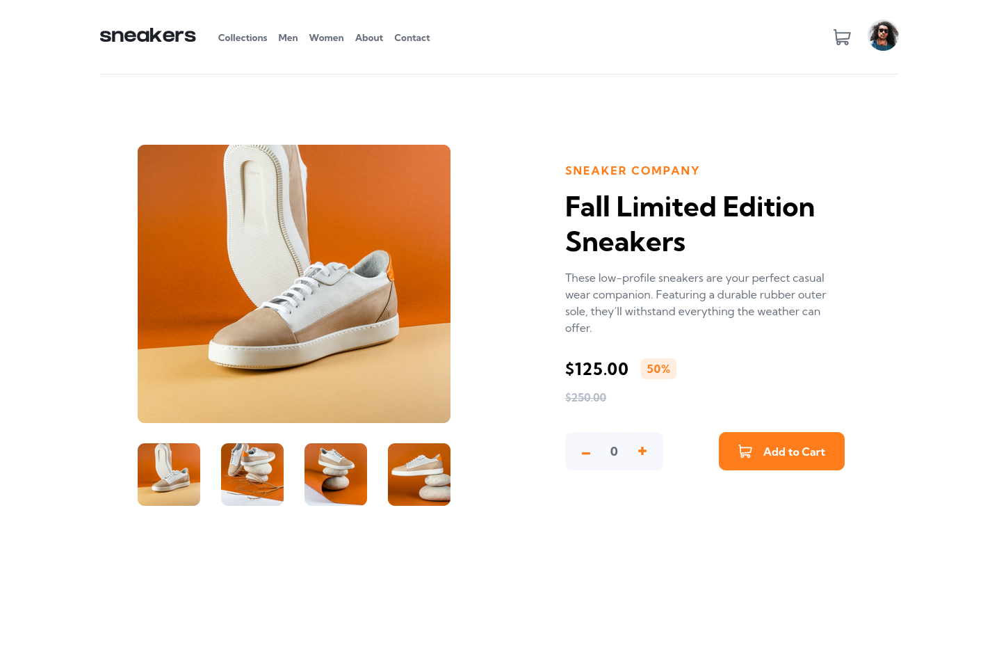
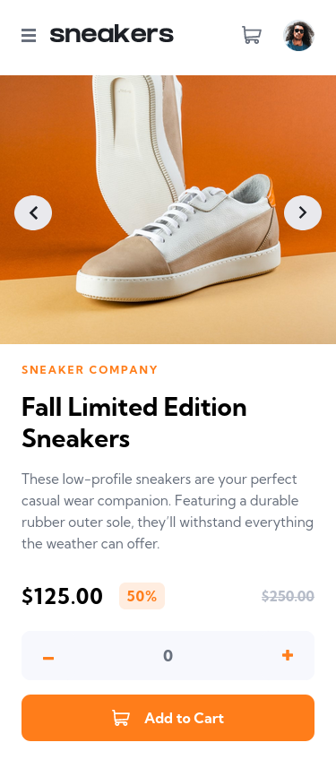

# Frontend Mentor - E-commerce product page solution

This is a solution to the [E-commerce product page challenge on Frontend Mentor](https://www.frontendmentor.io/challenges/ecommerce-product-page-UPsZ9MJp6). Frontend Mentor challenges help you improve your coding skills by building realistic projects.

## Table of contents

- [Overview](#overview)
  - [The challenge](#the-challenge)
  - [Screenshot](#screenshot)
  - [Links](#links)
- [My process](#my-process)
  - [Built with](#built-with)
- [Author](#author)

## Overview

### The challenge

Users should be able to:

- View the optimal layout for the site depending on their device's screen size
- See hover states for all interactive elements on the page
- Open a lightbox gallery by clicking on the large product image
- Switch the large product image by clicking on the small thumbnail images
- Add items to the cart
- View the cart and remove items from it

### Screenshot

)

### Links

- Solution URL: [Frontend mentor](https://www.frontendmentor.io/solutions/react-react-styled-components-react-context-mobile-first-design-B1x9y7wL5#feedback)
- Github Repo: [Frontend mentor](https://github.com/Jakelanghel/ecommerce-product-page)
- Live Site URL: [github pages](https://jakelanghel.github.io/ecommerce-product-page/)

## My process

### Built with

- React
- React styled-components
- CSS custom properties
- Flexbox
- Mobile-first workflow
- [React](https://reactjs.org/) - JS library
- [Styled Components](https://styled-components.com/) - For styles

## Author

- Frontend Mentor - [@Jakelanghel](https://www.frontendmentor.io/profile/Jakelanghel)
